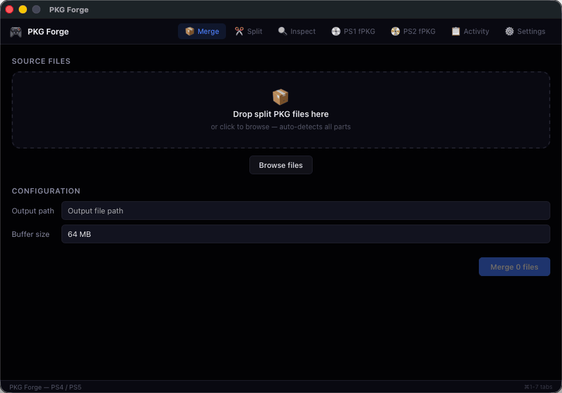

# PKG Forge

<div align="center">

**A native desktop toolbox for PlayStation PKG archives and PS1/PS2 PS4 fPKG workflows.**

Merge, split, inspect, checksum, rename, and build PS1/PS2 fPKGs from one cross-platform app.

[](https://github.com/Ketlark/PKGForge/releases/latest)
[](https://go.dev/)
[](https://wails.io/)
[](https://github.com/Ketlark/PKGForge/releases/latest)
[](LICENSE)

[Download latest release](https://github.com/Ketlark/PKGForge/releases/latest) ·
[Features](#features) ·
[Auto-update](#auto-update) ·
[Supported inputs](#supported-inputs) ·
[Support](#support-the-project) ·
[Build from source](#build-from-source) ·
[Legal notice](#legal-notice)

</div>

<p align="center">
  
</p>

PKG Forge is built with a **Svelte** frontend and a **Go** backend, packaged as a native desktop app through [Wails](https://wails.io/). The core archive and fPKG logic lives in Go, with no external packaging binaries required for the main workflows.

## Why PKG Forge

| Focus | What it means |
|-------|---------------|
| **One desktop workflow** | Drag files in, choose the operation, track progress, cancel long jobs, and keep history in one app. |
| **Large archive handling** | Merge and split PKG files with configurable buffers, output naming, progress, speed, and ETA. |
| **Package insight** | Inspect PKG metadata, validate headers, calculate SHA-256, and rename files from detected metadata. |
| **PS1/PS2 fPKG creation** | Build PS4 fPKGs from PS1 and PS2 disc images with emulator assets, artwork handling, metadata, PlayGo data, and Debug RIF generation. |
| **Cross-platform releases** | GitHub Actions publish direct downloads for Windows, macOS universal, Linux amd64, and Linux arm64. |
| **In-app updates** | Sparkle on macOS (full `.app` swap); built-in updater on Windows and Linux with SHA256 verification. |

## Creator

PKG Forge is created and maintained by [Kévin Dehoux / Ketlark](https://github.com/Ketlark), a full-stack developer and cloud engineer. The project is independent, open source, and built around practical archive management, preservation, homebrew, and backup workflows.

## Support the project

If PKG Forge saves you time, the most useful support is to:

- Star the [GitHub repository](https://github.com/Ketlark/PKGForge).
- Share the [latest release](https://github.com/Ketlark/PKGForge/releases/latest) with people who need this workflow.
- Report reproducible bugs or edge cases in [Issues](https://github.com/Ketlark/PKGForge/issues).
- Use [GitHub Sponsors](https://github.com/sponsors/Ketlark) if direct sponsorship is available for the creator.

## Latest changes

Recent work on `main` since v1.2.0:

- Cross-platform auto-update: Sparkle on macOS release builds, built-in GitHub updater on Windows/Linux.
- About page with version display, update checks, and project/support links.
- PS1 multi-bin CUE INDEX recalculation for merged disc images (fixes boot stalls on multi-track games).
- Release CI: version sync, signed `appcast.xml`, optional Apple codesigning.

See [docs/auto-update.md](docs/auto-update.md) for maintainer setup.

## Features

| Area | Capabilities |
|------|--------------|
| **Merge** | Recombine split PKG parts into one file. Selecting one part can auto-detect related files. |
| **Split** | Split a PKG into chunks with configurable size, buffer, and filename format. |
| **Inspect** | Read PKG header metadata such as content ID, title ID, region, content type, DRM, and sizes. |
| **Checksum** | Calculate SHA-256 with progress updates and cancellation. |
| **Rename** | Suggest and apply clean names based on inspected metadata when available. |
| **PS1 fPKG** | Build PS4 fPKGs from PS1 `.cue` / `.bin` images, including multi-disc input, title detection, cover art, emulator assets, PlayGo metadata, and Debug RIF generation. |
| **PS2 fPKG** | Build PS4 fPKGs from PS2 `.iso`, `.cue`, or `.bin` images, with SYSTEM.CNF detection and emulator configuration support. |
| **UX** | Dark desktop UI, drag-and-drop, file picker, progress, ETA, cancellation, activity log, settings, and keyboard navigation. |
| **About & support** | Project context, creator profile, repository links, support actions, and legal notes from inside the app. |
| **Updates** | Check for updates from About; optional startup check in Settings. macOS uses Sparkle; Windows/Linux download and apply in-app. |
| **i18n** | English and French interface strings. |

Keyboard shortcuts: `Cmd/Ctrl+1` through `Cmd/Ctrl+7` switch between the main workflow tabs; `Cmd/Ctrl+8` opens About.

## Auto-update

| Platform | Mechanism | Notes |
|----------|-----------|-------|
| **macOS** | [Sparkle](https://sparkle-project.org/) | Release builds replace the full `.app` bundle. Native update UI. |
| **Windows / Linux** | Built-in Go updater | GitHub Releases + `SHA256SUMS.txt`; download and restart from About. |

- Toggle **check on startup** in Settings.
- Dev builds (`Version=dev`) skip update checks.
- Maintainer setup (EdDSA keys, GitHub secrets, optional Apple signing): **[docs/auto-update.md](docs/auto-update.md)**.

## Downloads

Get the latest published binaries from the [GitHub Releases page](https://github.com/Ketlark/PKGForge/releases/latest).

| Platform | Asset |
|----------|-------|
| Windows amd64 | [`pkg-forge-windows-amd64.exe`](https://github.com/Ketlark/PKGForge/releases/latest/download/pkg-forge-windows-amd64.exe) |
| macOS universal | [`pkg-forge-macos-universal.zip`](https://github.com/Ketlark/PKGForge/releases/latest/download/pkg-forge-macos-universal.zip) |
| Linux amd64 | [`pkg-forge-linux-amd64`](https://github.com/Ketlark/PKGForge/releases/latest/download/pkg-forge-linux-amd64) |
| Linux arm64 | [`pkg-forge-linux-arm64`](https://github.com/Ketlark/PKGForge/releases/latest/download/pkg-forge-linux-arm64) |
| Checksums | [`SHA256SUMS.txt`](https://github.com/Ketlark/PKGForge/releases/latest/download/SHA256SUMS.txt) |
| Sparkle feed (macOS) | [`appcast.xml`](https://github.com/Ketlark/PKGForge/releases/latest/download/appcast.xml) |

Linux binaries may need execute permission after download:

```bash
chmod +x pkg-forge-linux-amd64
```

## Supported inputs

### Split package detection

These patterns are used for detection and ordering when merging split releases:

| Pattern | Example |
|---------|---------|
| `*_NNN.pkgpart` | `Game_001.pkgpart` |
| `*.pkg.NNN` | `Game.pkg.001` |
| `*.pkg_N` | `Game.pkg_0` |
| `*_N.pkg` | `Game_0.pkg` |
| `*.partN.pkg` | `Game.part0.pkg` |

### fPKG disc inputs

| Platform | Accepted input | Notes |
|----------|----------------|-------|
| PS1 | `.cue` or `.bin` | A `.cue` plus its referenced `.bin` files represents one disc. Use Disc 2 only for a second logical CD, not for the companion BIN of Disc 1. |
| PS2 | `.iso`, `.cue`, or `.bin` | `.bin` inputs are resolved through a companion `.cue` when present. |

## fPKG builder notes

PS1 cover art is optional. A local `<cue>_cover.png`, `<cue>_cover.jpg`, or `<cue>-cover.jpg` next to the CUE takes priority. If no local cover is found, PKG Forge tries known serial-based cover sources and caches a 512x512 PNG.

PS1 launch backgrounds follow this priority:

1. User-supplied background.
2. Local game background next to the CUE.
3. Bundled official PS1HD default background.
4. Cover-derived generated background.
5. Generated fallback artwork.

Runtime emulator files are bundled with the app by default. The emulator directory setting is an override for development or diagnostics, not a normal requirement for creating PS1/PS2 fPKGs.

PS1 packages include PCSX-Redux OpenBIOS as a redistributable BIOS fallback for PS1HD. See [THIRD_PARTY_NOTICES.md](THIRD_PARTY_NOTICES.md).

The fPKG builder is native Go and follows LibOrbisPkg layout rules for PKG entries, PlayGo metadata, Debug RIF, and signed/encrypted outer PFS images. Tests compare generated package entry layout and sizes against PkgTool.Core output for regression coverage.

## Build from source

### Requirements

- Go 1.23 or newer
- Node.js 18+ for the frontend toolchain
- Wails CLI v2

Install Wails:

```bash
go install github.com/wailsapp/wails/v2/cmd/wails@latest
```

Platform-specific compiler and webview dependencies follow the [Wails installation guide](https://wails.io/docs/gettingstarted/installation).

### Development

```bash
wails dev
```

### Production build

```bash
wails build
```

Artifacts appear under `build/bin/`. The exact layout depends on your OS and Wails version.

**macOS release build (with Sparkle auto-update):**

```bash
CGO_ENABLED=1 CGO_LDFLAGS='-Wl,-rpath,@loader_path/../Frameworks' \
  wails build -platform darwin/universal -tags sparkle -clean
```

The post-build hook in `wails.json` embeds `Sparkle.framework` into the `.app`.

### Tests

```bash
go test ./...
npm --prefix frontend run build
```

## CI/CD and releases

GitHub Actions run on every push or pull request to `main` or `master`: `go vet`, `go test`, frontend `npm ci`, `npm run build`, and `svelte-check`.

Automatic releases are created by pushing an annotated tag matching `v*`.

```bash
git tag -a v1.2.0 -m "Release v1.2.0"
git push origin v1.2.0
```

Before building, CI syncs `wails.json` `info.productVersion` from the tag so `CFBundleVersion`, `main.Version`, and the Sparkle appcast stay aligned.

The release workflow builds:

| Asset | Contents |
|-------|----------|
| `pkg-forge-windows-amd64.exe` | Windows executable |
| `pkg-forge-linux-amd64` | Linux x86_64 binary |
| `pkg-forge-linux-arm64` | Linux ARM64 binary |
| `pkg-forge-macos-universal.zip` | macOS `.app` bundle (Sparkle-enabled) |
| `SHA256SUMS.txt` | Checksums for release binaries |
| `appcast.xml` | Sparkle update feed for macOS |

**Maintainers:** configure Sparkle EdDSA keys and optional Apple signing secrets as described in **[docs/auto-update.md](docs/auto-update.md)**.

The Linux arm64 job uses the hosted runner `ubuntu-24.04-arm`, which is available for public repositories on GitHub. For private repositories, remove or adjust that matrix entry if the runner is unavailable.

## Project layout

```text
pkg-forge/
├── main.go                 # Wails entry, embedded frontend assets, Version var
├── app.go                  # Wails bindings between Go and Svelte
├── wails.json              # Wails app metadata, info.productVersion, post-build hooks
├── scripts/                # Release helpers (version sync, Sparkle, signing, appcast)
├── core/                   # Pure Go logic, no Wails import
│   ├── merge.go            # Merge pipeline
│   ├── split.go            # Split pipeline
│   ├── detect.go           # Split part detection and ordering
│   ├── validate.go         # PKG header validation
│   ├── inspect.go          # Metadata extraction
│   ├── checksum.go         # SHA-256 with progress
│   ├── rename.go           # Rename suggestions and apply
│   ├── diskspace*.go       # Free space helpers, OS-specific
│   ├── history.go          # Local activity/history persistence
│   ├── config.go           # User config (incl. checkUpdatesOnStartup)
│   ├── update_common.go    # Update types, semver helpers
│   ├── update_builtin.go   # GitHub updater (Windows/Linux, macOS dev)
│   ├── update_sparkle.go   # Sparkle backend (macOS release, -tags sparkle)
│   ├── fpkg/               # Native PS1/PS2 PS4 fPKG builder
│   ├── format.go, progress.go, options.go
│   └── *_test.go
├── docs/
│   ├── auto-update.md      # Auto-update setup, secrets, troubleshooting
│   └── adr/                # Architecture decision records
└── frontend/               # Svelte + Vite
    └── src/
        ├── App.svelte      # Shell, tabs, shortcuts, startup update check
        ├── app.css
        └── lib/
            ├── components/ # Merge, Split, Inspect, About, Settings, PS1, PS2
            ├── stores/     # i18n, activity, merge/split/fPKG/update state
            ├── utils/
            └── types/
```

Generated bindings under `frontend/wailsjs/` are produced by Wails during `wails dev` and `wails build`. Do not edit them by hand.

## Legal notice

This tool is intended for legitimate uses such as managing backups or archives you are entitled to handle. You are responsible for complying with applicable laws, platform terms, and intellectual property rules. The authors do not endorse piracy or DRM circumvention.

PKG Forge is an independent open-source project and is not affiliated with Sony Interactive Entertainment.

## Contributing

Issues and pull requests are welcome. Before submitting changes, run:

```bash
go test ./...
npm --prefix frontend run build
```

Please match the existing Go and Svelte style, keep changes focused, and include tests for behavior that affects archive or fPKG generation.

## License

[MIT](LICENSE) © Ketlark.

## Acknowledgements

Built with [Wails](https://wails.io/), [Svelte](https://svelte.dev/), and [Vite](https://vitejs.dev/).
